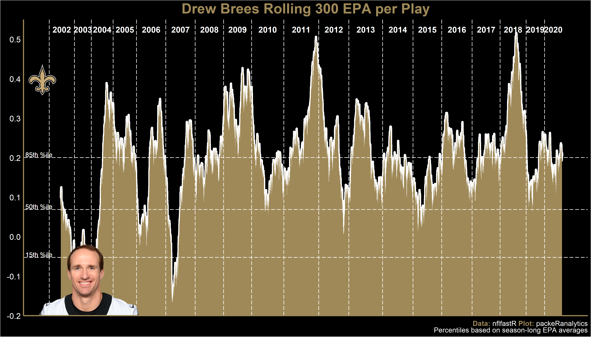
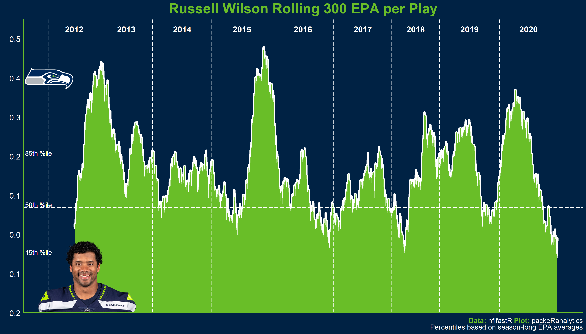
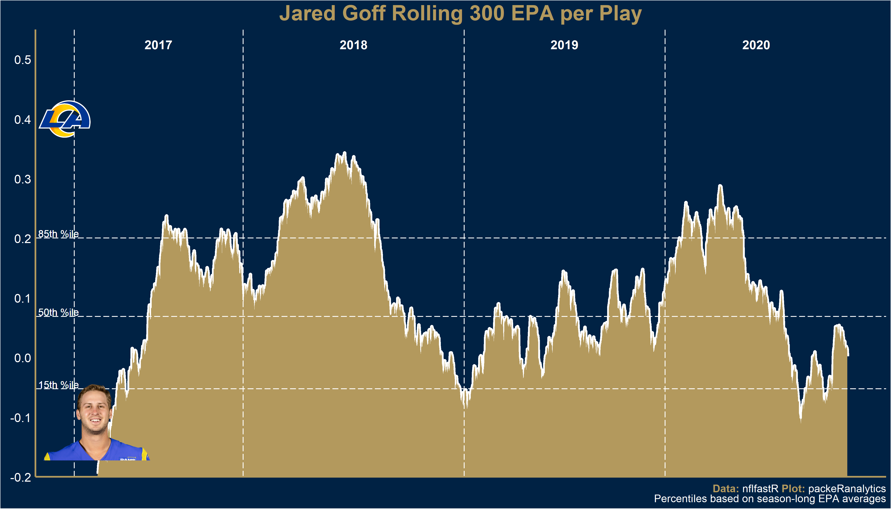
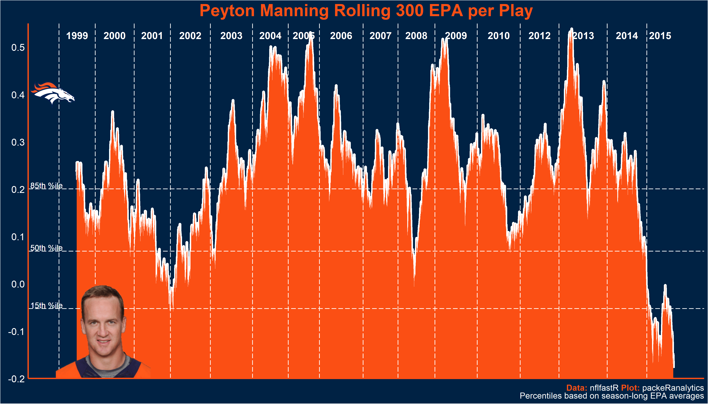
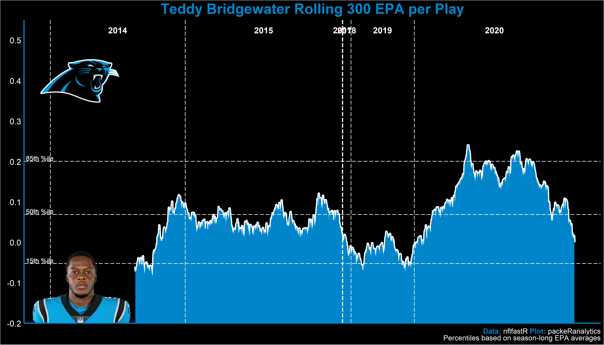
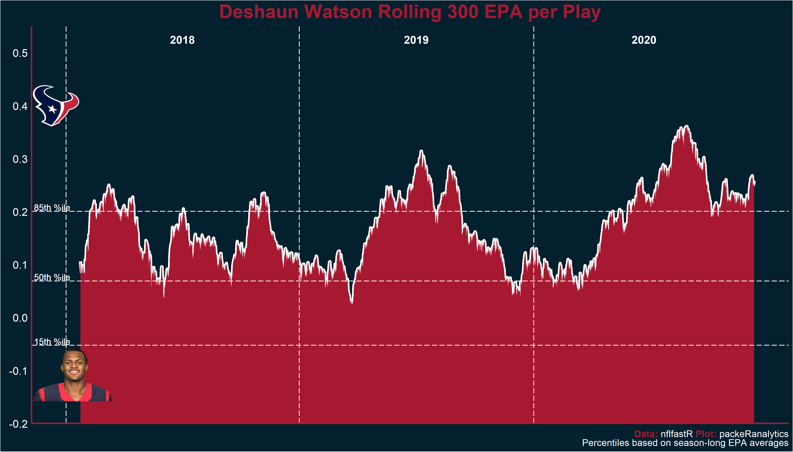

# qb-rolling-epa-function
how to plot rolling epa plots with nflfastR

## Introduction
This page will show you how to make plots like the one below with the nflfastR package. 
<!-- -->

The following assumes you have some familiarity with nflfastR. If you don't but are interested in learning more I recommend starting with [Ben Baldwin's nflfastR begginer's guide](https://www.nflfastr.com/articles/beginners_guide.html) or [Lee Sharpe's R and RStudio Intro](https://github.com/leesharpe/nfldata/blob/master/RSTUDIO-INTRO.md#r-and-rstudio-introduction).

## Gather Data
First we are going to pull in data for every quarterback. Then we will load a function to run on the data for a series of quarterbacks.

```r
library(tidyverse)
# Gather names, team, gsis_id, link to headshot, and join with team colors
  rosters <- nflfastR::fast_scraper_roster(1999:2020) %>%
    filter(position == "QB") %>% 
    select(full_name, first_name, last_name, team, gsis_id, headshot_url)
    
# Set working directory  
  setwd("C:/Users/###")
  
# Check for missing games in play-by-play data
  nflfastR::update_db()
  
# Establish connection to pbp database
  connection <- RSQLite::dbConnect(RSQLite::SQLite(), "./pbp_db")
  pbp_db <- tbl(connection, "nflfastR_pbp")  
  
# Filter pbp to qb dropbacks w/ qb_epa
  pbp_all <- pbp_db %>% 
    filter((pass == 1 | rush == 1) & !is.na(down) & !is.na(qb_epa) & (!is.na(passer_player_id) | !is.na(rusher_player_id))) %>% 
    select(id, name, season, posteam, desc, play, pass, rush, qb_epa) %>% 
    collect()
  
# Disconnect from db
  DBI::dbDisconnect(connection)
  
# Group play-by-play by quarterback, sequence dropbacks, 
# Calculate rolling 300 epa per play
  pbp_all <- pbp_all %>% 
    nflfastR::decode_player_ids() %>% 
    group_by(id, name) %>% 
    mutate(
      play_num = seq_along(play),
      mean_300 = zoo::rollmean(qb_epa, 300, fill = NA, align = "right")
    ) %>% 
    ungroup() 
```
## Function
The can take four inputs. 1) The quarterback's full name, 2) what season you want the plot to start, 3) the background color of the plot, and 4) the color of the text and plot fill. Note as this is currently written the function will use the colors of the last team the quarterback has a play with. Additionally, it errors out if you choose a quarterback that doesn't have a headshot image url. You also need to know the exact spelling of the quarterback. If you have ideas on how to improve please let me know!

```r
    roll_epa_plot <- function(qb = "Aaron Rodgers", since = 1999, color1 = "team_color", color2 = "team_color2") {
     
  # Store name of qb entered into variable
      qb <<- qb

  # Gather names, team, gsis_id, link to headshot, and join with team colors
    df <- rosters %>% 
      filter(full_name == qb) %>% 
      tail(1) %>% 
      dplyr::left_join(
        nflfastR::teams_colors_logos,
        by = c("team" = "team_abbr"))  
    
    # Pull out some values
      long_name <- df %>% 
        select(full_name) %>% 
        pull()
      
      gsis_id <- df %>% 
        select(gsis_id) %>% 
        pull

      team <- df %>% 
        select(team) %>% 
        pull()
      
      team_color <- df %>% 
        select(all_of(color1)) %>% 
        pull()
      
      team_color2 <- df %>% 
        select(all_of(color2)) %>% 
        pull()
      
      qb_img <- df %>% 
        select(headshot_url) %>% 
        pull() 
      
      qb_img <- magick::image_read(qb_img)
      qb_img <- grid::rasterGrob(qb_img, interpolate = T)
      
      tm_img <- df %>% 
        select(team_logo_espn) %>% 
        pull()
      
      tm_img <- magick::image_read(tm_img)
      tm_img <- grid::rasterGrob(tm_img, interpolate = T)
      
      pbp <- pbp_all %>% 
        filter(season >= since & id == gsis_id)
      
    # Find first play and last play of ultimate plot
      x_min <- min(pbp$play_num[!is.na(pbp$mean_300)])
      x_max <- max(pbp$play_num)
      x_range <- x_max - x_min
      
    # Find play number where each season started and where median play number is
    # for each season
      szns <- pbp %>% 
        group_by(season) %>% 
        summarize(
          start = min(play_num),
          med = median(play_num),
          .groups = 'drop')
      
    # Find seasons where 300th dropback occurred and where last dropback occurred
      beg_szn <-max(as.integer(pbp$season[pbp$play_num == 300]), since)
      end_szn <- as.integer(max(pbp$season))
      
    # Summarize seasons by qb's with over 350 attempts
        lg_sum <- pbp_all %>% 
          filter(pass == 1) %>% 
          group_by(name, season) %>% 
          summarize(
            n = n(),
            qb_epa = mean(qb_epa),
            .groups = 'drop'
          ) %>% 
          filter(n >= 350) %>% 
          arrange(-qb_epa) %>% 
          mutate(per_rank = percent_rank(qb_epa))
        
      # Calculate percentiles
        percentiles <- c(
          quantile(lg_sum$qb_epa, .15),
          quantile(lg_sum$qb_epa, .5),
          quantile(lg_sum$qb_epa, .85)
        )
        
        my_caption <- glue::glue("<span style='color:{team_color2};'>**Data:**</span> nflfastR <span style='color:{team_color2};'>**Plot:**</span> packeRanalytics<br>Percentiles based on season-long EPA averages")
        
      # Create the plot
        pbp %>% 
          filter(play_num > x_min) %>% 
          ggplot(aes(play_num, mean_300)) +
          geom_line(size = 2, color = "white") +
          geom_ribbon(aes(
            # ymin = quantile(lg_sum$qb_epa, .5), 
            ymin = -Inf,
            ymax = mean_300, fill = long_name),
            show.legend = FALSE) +
          scale_fill_manual(values = team_color2) + 
          geom_hline(yintercept = percentiles, color = "white", linetype = "longdash") +
          geom_text(x = -Inf, y = quantile(lg_sum$qb_epa, .15)+.0075, label = " 15th %ile", hjust = 0, size = 4, color = "white") +
          geom_text(x = -Inf, y = quantile(lg_sum$qb_epa, .5)+.0075, label = " 50th %ile", hjust = 0, size = 4, color = "white") +
          geom_text(x = -Inf, y = quantile(lg_sum$qb_epa, .85)+.0075, label = " 85th %ile", hjust = 0, size = 4, color = "white") +
          labs(
            # caption = "Percentiles based on season-long EPA averages\n <br>**Data:** nflfastR | **Plot:** @packeRanalytics",
            caption = my_caption,
            title = paste(long_name, "Rolling 300 EPA per Play")) +
          theme(
            plot.caption = ggtext::element_markdown(size = 12, color = "white"),
            panel.background = element_rect(fill = team_color),
            plot.background = element_rect(fill = team_color),
            panel.grid = element_blank(),
            axis.text.y = element_text(color = "white", size = 14),
            axis.title.y = element_text(color = "white", size = 16),
            axis.text.x = element_blank(),
            axis.title.x = element_blank(),
            axis.line.y = element_line(color = team_color2, size = 1),
            axis.line.x = element_line(color = team_color2, size = 1),
            axis.ticks = element_blank(),
            plot.title = element_text(size = 24, 
                                      hjust = 0.5,
                                      face = "bold",
                                      color = team_color2)) +
          scale_y_continuous(name = element_blank(), expand = c(0,0), limits = c(-.20, .55), breaks = seq(-.2, .50, by = .1)) + 
          geom_text(aes(x = med, y = .525, label = season), data = szns %>% 
                      filter(season >= beg_szn),
                    hjust = .5, fontface = "bold",
                    color = "white", size = 5) +
          geom_vline(aes(xintercept = start), color = "white", linetype = "longdash",
                     data = szns %>% 
                       filter(season >= beg_szn)) +
          annotation_custom(qb_img, xmin = -Inf, xmax = x_range*.2, ymin = -Inf, ymax = .0) +
          # annotation_custom(qb_img, xmin = -Inf, xmax = 300, ymin = -Inf, ymax = .0) +
          annotation_custom(tm_img, xmin = -Inf, xmax = 300, ymin = .30, ymax = .50)
   }
```
While we are here let's look at some quarterbacks!

## NFC Playoff Teams
Drew Brees has been one of the most consistently good quarterbacks in history. Brees last 300 snaps have been as good as an 85th percentile (top 5 season). Note how the order of the team colors is switched to show black in the background.

```r
roll_epa_plot("Drew Brees", color1 = "team_color2", color2 = "team_color")
```

<!-- -->
Russ somehow had one of his best and worst 300 play stretches in 2020. Coming into the playoffs his last 300 plays are equivalent to a 15th percentile season.

```r
roll_epa_plot("Russell Wilson")
```

<!-- -->
Alex Smith crossed the 85th percentile line with Andy Reid and the Chiefs in 2017 but has fallen off a cliff since then.

```r
roll_epa_plot("Alex Smith")
```

<!-- -->
Tom's rolling averaged collapsed to a low not seen since 2003! But of course he's back above 85th percentile going into the playoffs.

```r
roll_epa_plot("Tom Brady", color1 = "team_color2", color2 = "team_color")
```

<!-- -->
Let's hope Jared Goff can get healthy by Sunday. And wow quite the roller coaster so far.

```r
roll_epa_plot("Jared Goff")
```

<!-- -->
Oh boy how are the Bears going to handle this.

```r
roll_epa_plot("Mitchell Trubisky")
```

<!-- -->
## AFC Playoff Teams
Literally every stretch of Patrick Mahomes career has been at worst equivalent to a top 5 NFL season. Remarkable.

```r
roll_epa_plot("Patrick Mahomes")
```

<!-- -->
Josh Allen 2020 jump is impressive. 

```r
roll_epa_plot("Josh Allen")
```

<!-- -->
Is this the same cliff as we saw with Peyton Manning at the end?

```r
roll_epa_plot("Ben Roethlisberger")
```

<!-- -->

```r
roll_epa_plot("Peyton Manning")
```

<!-- -->
I absolutely did not think Ryan Tannehill could be as efficient in 2020 as he was in 2019. Barely 50th percentile play for 7 seasons now two in the top 3.

```r
roll_epa_plot("Ryan Tannehill")
```

<!-- -->
Don't look now but the 2019 NFL MVP is on the rise.

```r
roll_epa_plot("Lamar Jackson", color1 = "team_color2", color2 = "team_color")
```

<!-- -->
Baker went from ending his rookie season in the 85th percentile to dropping to below 15th in 2019 back to 85th in 2020.

```r
roll_epa_plot("Baker Mayfield", color1 = "team_color2", color2 = "team_color")
```

<!-- -->
Phil.

```r
roll_epa_plot("Philip Rivers")
```

<!-- -->

## NFC East
Probably not a great sign if Daniel Jones hasn't had stretches of play above 50th percentile yet.

```r
roll_epa_plot("Daniel Jones")
```

<!-- -->
Don't have enough data for Jalen Hurts so here is Wentz. :/

```r
roll_epa_plot("Carson Wentz")
```

<!-- -->
Pay the man.

```r
roll_epa_plot("Dak Prescott")
```

<!-- -->
## NFC North

```r
roll_epa_plot("Kirk Cousins")
```

<!-- -->

```r
roll_epa_plot("Matthew Stafford")
```

<!-- -->
## NFC West

```r
roll_epa_plot("Kyler Murray", color1 = "team_color2", color2 = "team_color")
```

<!-- -->
I have never spelled Garoppolo right on the first try. Also, don't know why the size of Jimmy's image is so off. If you know how to fix that let me know.

```r
roll_epa_plot("Jimmy Garoppolo")
```

<!-- -->
## NFC South
Ryan is not ending 2020 on a good note. 

```r
roll_epa_plot("Matt Ryan", color1 = "team_color2", color2 = "team_color")
```

<!-- -->
Teddy and the Panthers outplayed expectations in 2020. 

```r
roll_epa_plot("Teddy Bridgewater", color1 = "team_color2", color2 = "team_color")
```

<!-- -->
## AFC East

```r
roll_epa_plot("Cam Newton")
```

<!-- -->
Both of the Jets colors are green in nflfastR so this looks terrible and I haven't bothered to fix it yet.

```r
roll_epa_plot("Sam Darnold")
```

<!-- -->

```r
roll_epa_plot("Ryan Fitzpatrick")
```

<!-- -->
## AFC North

```r
roll_epa_plot("Joe Burrow")
```

<!-- -->
## AFC South
Will probably a really underappreciated season.

```r
roll_epa_plot("Deshaun Watson")
```

<!-- -->


```r
roll_epa_plot("Gardner Minshew")
```

<!-- -->
## AFC West
Not great.

```r
roll_epa_plot("Drew Lock")
```

<!-- -->
Inverse Drew Lock.

```r
roll_epa_plot("Justin Herbert")
```

<!-- -->
Carr hit peaks in 2020 that were higher than his 2016 season. 

```r
roll_epa_plot("Derek Carr", color1 = "team_color2", color2 = "team_color")
```

<!-- -->

